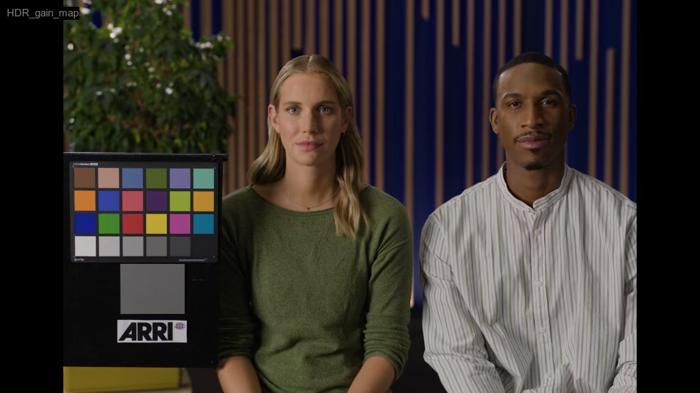
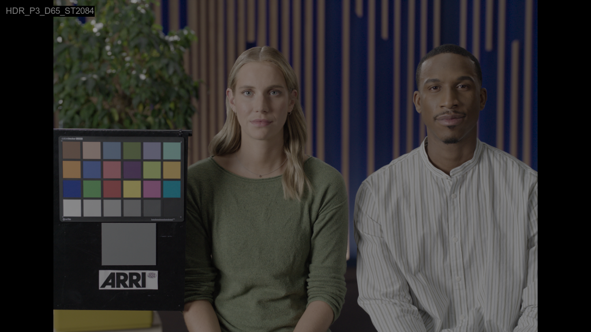
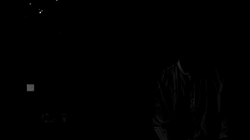

# Python for HDR EXIF learning

HDR_EXIF.py Modifications
Overview
Modified
HDR_EXIF.py
 to implement a robust HDR workflow with three export options, including a true HDR gain map implementation.

Key Features

1. Dual ICC Profile Export
Profiles:
HDR_P3_D65_ST2084.icc
 and
P3_PQ.icc
Method: ImageMagick conversion with embedded profiles
Output: Two HEIC files per input
2. HDR Gain Map Export
Method: Full gain map generation pipeline
Dependencies: numpy, opencv-python, heif-enc, exiftool
Process:
Load 16-bit TIFF
Linearize PQ to Nits (using standard ST 2084 EOTF)
Generate SDR Base Image (ACES2.0 P3D65PQ1000_to_sRGB22.cube)
Calculate Gain Map (HDR Linear / SDR Linear)
Stitch Base + Gain Map using heif-enc
Inject Apple HDR Headroom metadata
3. Text Overlay
Style: Arial font, 15px size, Gray 0.5 text on Black highlight
Content: Displays the profile name (e.g., "HDR_gain_map")
Applied to: All three export versions
4. Organization
Output: All files saved to converted/ subfolder
Naming: <filename>_<profile_name>.heic

Generated Files
filename_HDR_P3_D65_ST2084.heic
filename_P3_PQ.heic
filename_HDR_gain_map.heic

## Example Outputs

### Converted HEIC Files

*HDR Gain Map export with text overlay*

*HDR P3 D65 ST2084 profile export*

*P3 PQ profile export*

### Gain Map Visualizations

*Full resolution gain map*

*Half resolution gain map (embedded in HEIC)*

Usage

# Activate virtual environment (required for numpy/cv2)

source .venv/bin/activate

# Run script

python3 HDR_EXIF.py <input_file_or_directory>
